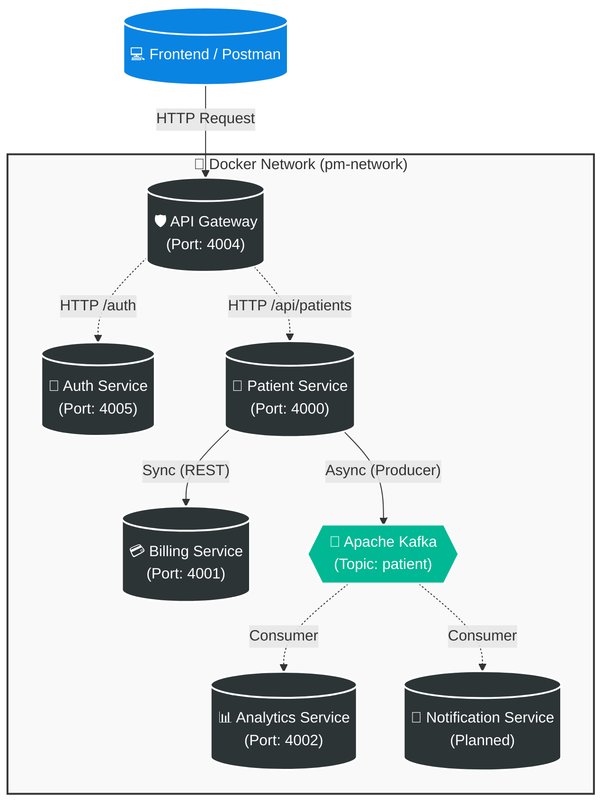

# Healthcare Microservices System

A distributed healthcare management system built with **Java 21** and **Spring Boot 3.5**. This project demonstrates a modern microservices architecture utilizing synchronous **REST APIs** for critical transactions and asynchronous **Kafka** event streaming for analytics.

## 🏗 System Architecture

The following diagram illustrates the data flow and container interactions within the Docker network:



-----

## 🚀 Key Features

  * **Microservices Architecture:** 5 distinct services with single responsibilities.
  * **Hybrid Communication:**
      * **Synchronous:** Uses **REST APIs** for standard, low-latency communication between Patient and Billing services.
      * **Asynchronous:** Uses **Apache Kafka** to decouple the Patient creation flow from Analytics processing.
  * **API Gateway:** Centralized entry point using **Spring Cloud Gateway** to route requests.
  * **Security:** **JWT** (JSON Web Token) based authentication and authorization.
  * **Containerization:** Fully dockerized environment with a custom bridge network (`pm-network`).

-----

## 🛠️ Tech Stack

  * **Language:** Java 21 (OpenJDK)
  * **Framework:** Spring Boot 3.5.3
  * **Messaging:** Apache Kafka (Bitnami image)
  * **Communication:** REST (Spring Web)
  * **Database:** PostgreSQL 17
  * **Build Tool:** Maven 3.9.9
  * **Documentation:** SpringDoc OpenAPI (Swagger)

-----

## 📦 Service Breakdown

| Service | Port | Description |
| :--- | :--- | :--- |
| **API Gateway** | `4004` | Entry point, handles routing to downstream services. |
| **Patient Service** | `4000` | Core service. Manages patient records (PostgreSQL). Orchestrates Billing via REST and Analytics via Kafka. |
| **Billing Service** | `4001` | Manages billing accounts. Accepts **REST** requests. |
| **Analytics Service**| `4002` | Consumes Kafka events (`PATIENT_CREATED`) for reporting. |
| **Auth Service** | `4005` | Handles User login and JWT token generation. |

-----

## 🏃‍♂️ Getting Started

### 1\. Prerequisites

  * Docker Desktop installed and running.
  * Java 21 (if running locally without Docker).
  * Maven.

### 2\. Build & Run (Docker)

First, create the shared network:

```bash
docker network create pm-network
```

#### Step 1: Infrastructure (Databases & Kafka)

```bash
# Patient DB
docker run -d --name patient-service-db --network pm-network -e POSTGRES_DB=patient_db -e POSTGRES_USER=admin_user -e POSTGRES_PASSWORD=password -p 5000:5432 postgres:17

# Auth DB
docker run -d --name auth-service-db --network pm-network -e POSTGRES_DB=auth_db -e POSTGRES_USER=admin_user -e POSTGRES_PASSWORD=password -p 5001:5432 postgres:17

# Kafka
docker run -d --name kafka --network pm-network -p 9092:9092 -p 9094:9094 -e KAFKA_CFG_NODE_ID=0 -e KAFKA_CFG_PROCESS_ROLES=controller,broker -e KAFKA_CFG_LISTENERS=PLAINTEXT://:9092,CONTROLLER://:9093,EXTERNAL://:9094 -e KAFKA_CFG_LISTENER_SECURITY_PROTOCOL_MAP=CONTROLLER:PLAINTEXT,EXTERNAL:PLAINTEXT,PLAINTEXT:PLAINTEXT -e KAFKA_CFG_CONTROLLER_QUORUM_VOTERS=0@kafka:9093 -e KAFKA_CFG_ADVERTISED_LISTENERS=PLAINTEXT://kafka:9092,EXTERNAL://localhost:9094 bitnami/kafka:latest
```

#### Step 2: Build & Run Microservices

*(Ensure you run `mvn clean package` in each service folder first to generate JARs)*

```bash
# Billing Service (Note: Port 9001 removed as gRPC is no longer used)
docker build -t billing-service ./billing-service
docker run -d --name billing-service --network pm-network -p 4001:4001 billing-service

# Patient Service
docker build -t patient-service ./patient-service
docker run -d --name patient-service --network pm-network -p 4000:4000 patient-service

# Analytics Service
docker build -t analytics-service ./analytics-service
docker run -d --name analytics-service-container --network pm-network -p 4002:4002 analytics-service

# API Gateway
docker build -t api-gateway ./api-gateway
docker run -d --name api-gateway --network pm-network -p 4004:4004 api-gateway:latest
```

-----

## 🧪 Testing the Workflow

### 1\. Create a Patient (The Full Flow)

**Endpoint:** `POST http://localhost:4004/api/patients`

**Body:**

```json
{
    "name": "Jane Doe",
    "email": "jane.doe@example.com",
    "address": "123 Health St",
    "dateOfBirth": "1990-01-01",
    "registeredDate": "2024-11-20"
}
```

**What happens internally:**

1.  **Patient Service** saves "Jane Doe" to PostgreSQL.
2.  **Patient Service** sends a **HTTP POST** request to the **Billing Service** to create an account.
3.  **Patient Service** sends a message to **Kafka** topic `patient`.
4.  **Analytics Service** consumes the message and logs: `Received Patient Event: [Jane Doe]`.

### 2\. Verify Analytics (Kafka Consumer)

Check the logs of the analytics container to see the asynchronous event processing:

```bash
docker logs analytics-service-container
```

*Output should show:* `Received Patient Event: [PatientId=..., PatientName=Jane Doe...]`.
